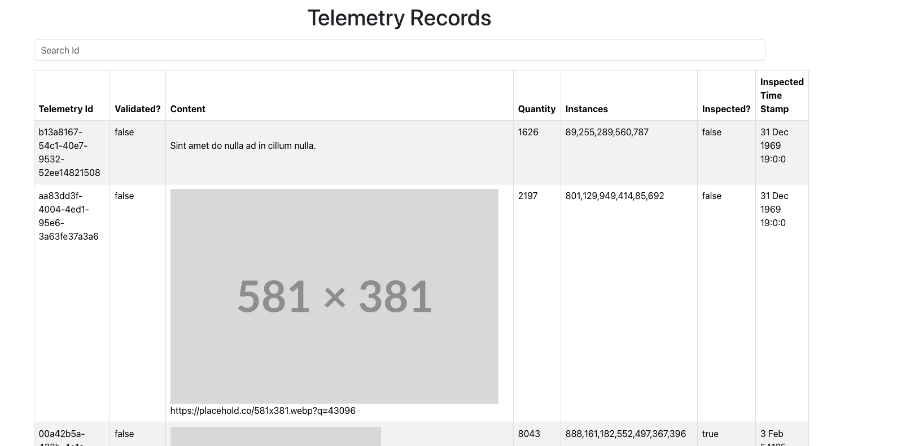

# Doxel Coding Assessment

This project is a react app meant to satisfy the criteria listed in:
https://docs.google.com/document/d/1YL4uagkZ4qjIGEYYf243BqGCmQkVHA0Xlr1rqBDVUu4/edit?usp=sharing

##

### `npm start`

Runs the app in the development mode.\
Open [http://localhost:3000](http://localhost:3000) to view it in your browser.

The page will reload when you make changes.\
You may also see any lint errors in the console.

## Things Missed/Not Quite Working/Known Issues

-Could not get sort to work properly
-Runtime Error: Maximum call stack size exceeded
-Content should be showing either text or image and is currently showing both
